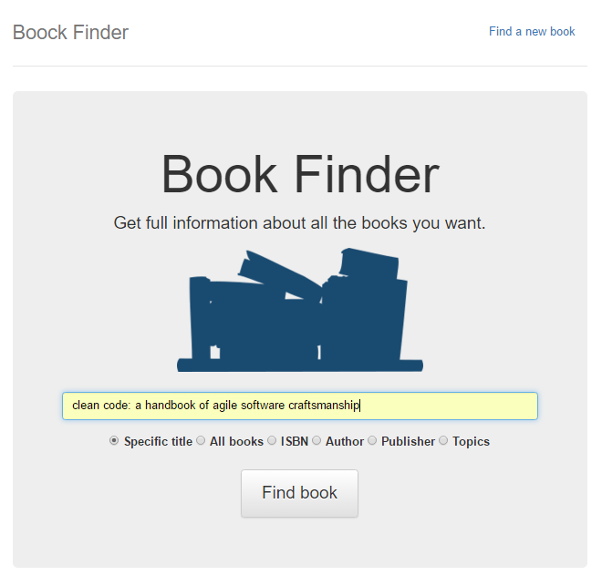
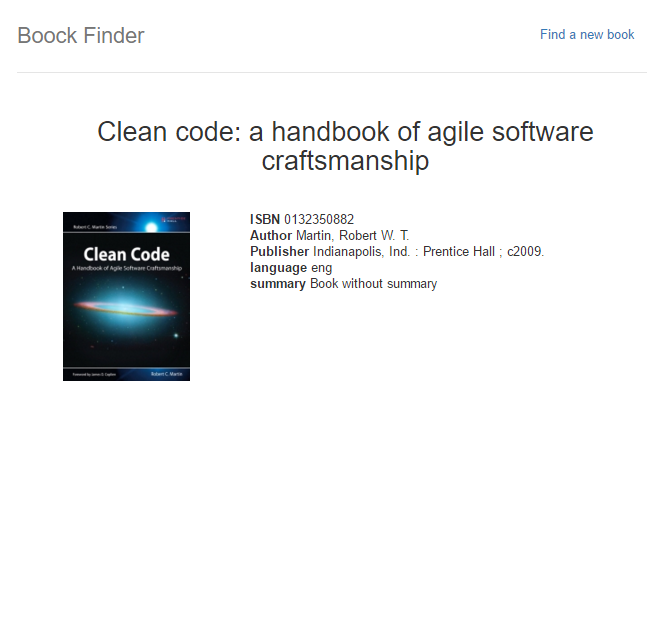
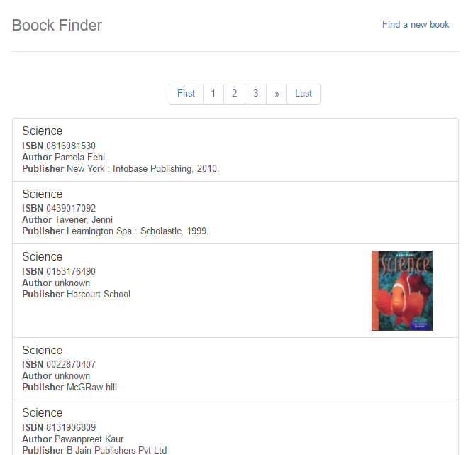

<h1 align="center">Book Finder</h1>

[](https://travis-ci.org/davidsanfal/taric-book-finder) [](https://www.python.org/downloads/)

Book Finder is a webapp wich use the [ISBNdb](http://isbndb.com/) and [LibraryThing](http://www.librarything.com) APIs to get books information.

- [ISBNdb APIv2 docs](http://isbndb.com/api/v2/docs)
- [LibraryThing cover API docs](http://blog.librarything.com/main/2008/08/a-million-free-covers-from-librarything/)


## Python Aplication requirements

#### Windows

```bash
cd taric-book-finder
pip install -r requirements.txt
```

#### Linux

```bash
cd taric-book-finder
sudo -H pip install -r requirements.txt
```

## Execute

Define the environment variables

#### Windows

```bash
SET ISBNDB_API_KEY=your_isbndb_api_key
SET LIBRARYTHING_API_KEY=your_librarything_api_key
SET SECRET_APP_KEY=your_webapp_key # you can use what you want
```

#### Linux

```bash
export ISBNDB_API_KEY=your_isbndb_api_key
export LIBRARYTHING_API_KEY=your_librarything_api_key
export SECRET_APP_KEY=your_webapp_key # you can use what you want
```

Launch the webapp.

```bash
cd taric-book-finder
python launcher.py
```

## Test

You need to use `nosetests` to run the tests.

you need to install the test requirements.

#### Windows

```bash
cd taric-book-finder
pip install -r requirements_test.txt
```

#### Linux

```bash
cd taric-book-finder
sudo -H pip install -r requirements_test.txt
```

Now, you can run the tests.

```bash
cd taric-book-finder
nosetests

...

Ran 33 tests in 6.333s

OK
```

# How to use Book Finder

**Home URL http://127.0..0.1:5000/**

<p align="center">

</p>

If you use the `specific title` or the `ISBN` tags, you will be redirected to the specific book if it exists

<p align="center">

</p>

If you use the other tags, you will be redirected to a book list with all the results.

<p align="center">

</p>


## License

Book Finder is licensed under a [Creative Commons Attribution-ShareAlike 4.0 International License](http://creativecommons.org/licenses/by-sa/4.0/). Please read the LICENSE files for more details.
